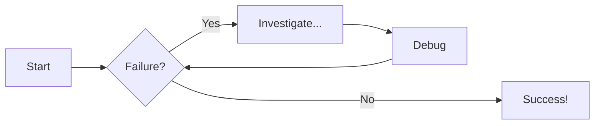

Example code block for Python:

```py
# Function to add two numbers

def add_two_numbers(num1, num2):
return num1 + num2

# Example usage

result = add_two_numbers(5, 3)
print('The sum is:', result)
```

# Diagram Examples

## Flowcharts


